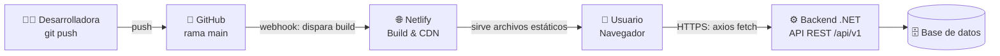
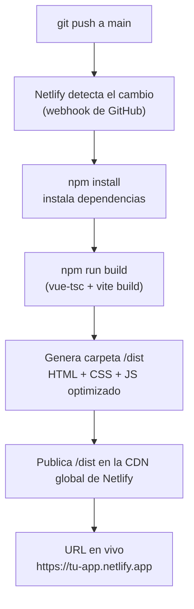
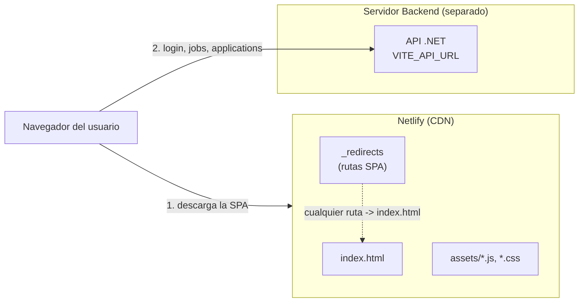
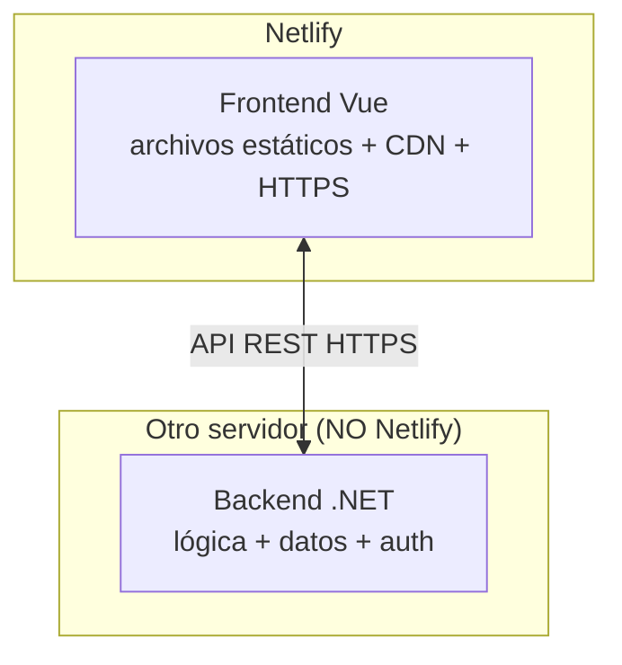

# Diagrama de Despliegue — Frontend en Netlify

Este documento describe cómo se despliega el **frontend** (Vue 3 + Vite + TypeScript)
en **Netlify** y cómo se conecta con el backend (.NET API).

> SPA = _Single Page Application_. La app es solo HTML/CSS/JS estático que el
> navegador descarga una vez y luego habla con la API por HTTP.

---

## 1. Vista general del despliegue



**Idea clave:** Netlify solo aloja el frontend ya compilado. El backend .NET vive
en **otro servidor** (Azure, Render, una VM, etc.) y la app del navegador lo llama
directamente vía HTTPS.

---

## 2. Flujo de build (qué pasa cuando haces `git push`)



---

## 3. Diagrama de componentes (en runtime)



---

## 4. Configuración necesaria en Netlify

### 4.1 Build settings (en el panel de Netlify)

| Campo | Valor |
|---|---|
| **Base directory** | `frontend` (solo si el repo tiene el frontend en una subcarpeta) |
| **Build command** | `npm run build` |
| **Publish directory** | `dist` |
| **Node version** | `20` o superior (lo exige `package.json` → `engines`) |

### 4.2 Variable de entorno

En **Site settings → Environment variables**, agrega:

| Clave | Valor (ejemplo de producción) |
|---|---|
| `VITE_API_URL` | `https://tu-backend.com/api/v1` |

> ⚠️ En local usas `http://localhost:5155/api/v1` (ver `.env.example`).
> En Netlify **no** sirve `localhost`: debe apuntar a la URL pública del backend.
> Toda variable que el navegador deba leer **tiene que empezar con `VITE_`**.

### 4.3 Redirecciones para SPA (importante)

Como usas `vue-router`, si un usuario recarga `tu-app.netlify.app/jobs`, Netlify
buscaría un archivo `/jobs` que no existe y daría **404**. Hay que decirle que
sirva siempre `index.html`.

Crea un archivo **`public/_redirects`** (Vite lo copia tal cual a `dist`):

```
/*    /index.html   200
```

O, alternativamente, un **`netlify.toml`** en la raíz del frontend:

```toml
[build]
  command = "npm run build"
  publish = "dist"

[[redirects]]
  from = "/*"
  to = "/index.html"
  status = 200
```

---

## 5. Checklist antes de desplegar

- [ ] El backend .NET está desplegado y accesible por **HTTPS** público.
- [ ] El backend permite **CORS** desde el dominio de Netlify.
- [ ] Variable `VITE_API_URL` configurada en Netlify (con la URL pública).
- [ ] Archivo `public/_redirects` (o `netlify.toml`) creado para las rutas SPA.
- [ ] `npm run build` corre sin errores en local.
- [ ] Build command = `npm run build`, Publish directory = `dist`.

---

## 6. Resumen de responsabilidades



| Capa | Dónde vive | Qué hace |
|---|---|---|
| Frontend | **Netlify** | Muestra la interfaz, navega rutas, llama a la API |
| Backend | Servidor aparte | Procesa datos, autenticación, base de datos |

---

_Stack detectado: Vue 3.5 · Vite 7 · TypeScript · Pinia · vue-router · vue-i18n · axios._
